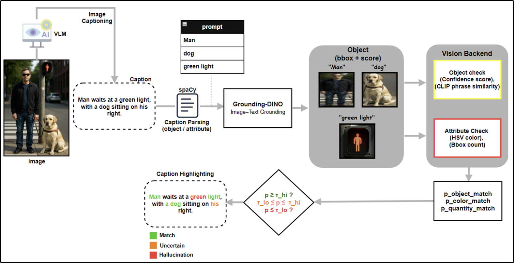
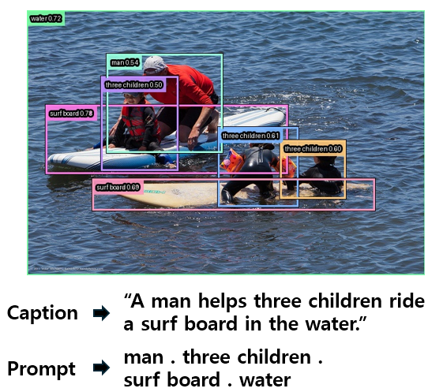
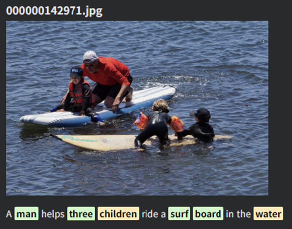
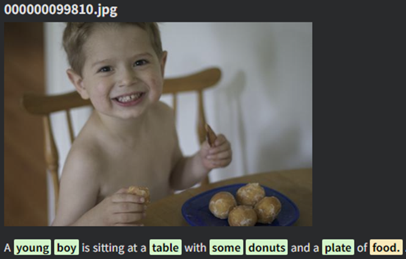
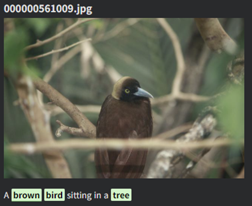

# VLM Hallucination Detection (Object / Color / Quantity)

본 프로젝트는 Vision-Language Model이 생성한 캡션에서  
**객체(Object)**, **색상(Color)**, **수량(Quantity)** 단위로 환각(Hallucination)을 탐지하고  
각 토큰을 Match / Uncertain / Hallucination으로 하이라이트하는 시스템입니다.

---

## 📌 Pipeline

<p align="center">
  
</p>

<p align="center"><em>
전체 파이프라인 (BLIP2 캡션 생성 → spaCy 파싱 → GroundingDINO 객체 검출 → 색상·수량 속성 검증 → 토큰 하이라이트)
</em></p>

---

## ⚙️ Requirements (CPU 환경 기준)

본 실험은 **CPU 환경**에서 수행되었습니다.

### Python Version
- Python 3.9+

### Install

```bash
# ========================
# BLIP2 (LAVIS)
# ========================
# BLIP2는 Salesforce/LAVIS repo를 그대로 clone해서 사용합니다.
git clone https://github.com/salesforce/LAVIS.git
cd LAVIS
pip install -r requirements.txt
pip install -e .
cd ..


# ========================
# GroundingDINO
# ========================
# GroundingDINO는 IDEA-Research GroundingDINO repo clone 후 설치
git clone https://github.com/IDEA-Research/GroundingDINO.git
cd GroundingDINO
pip install -r requirements.txt
pip install -e .
cd ..


# ========================
# open_clip
# ========================
# open_clip은 LAION의 오리지널 레포를 clone 후 설치
git clone https://github.com/mlfoundations/open_clip.git
cd open_clip
pip install -e .
cd ..


# ========================
# spaCy
# ========================
pip install spacy
python -m spacy download en_core_web_sm


# ========================
# Utils
# ========================
pip install numpy pandas pillow opencv-python matplotlib tqdm scikit-learn

```

---

## 🔗 Models & Libraries Used

| Component | Model / Library | GitHub |
|----------|------------------|--------|
| Caption Generation | BLIP2 (Salesforce/blip2-opt-2.7b) | https://github.com/salesforce/LAVIS |
| Caption Selection / Similarity | CLIP (OpenAI) | https://github.com/openai/CLIP |
| Phrase-level Alignment | open_clip (LAION) | https://github.com/mlfoundations/open_clip |
| Object Grounding | GroundingDINO | https://github.com/IDEA-Research/GroundingDINO |

---

## 📂 Dataset (MS COCO)

본 연구는 **MS COCO 2017 Validation Set** 기반으로 수행되었습니다.

- COCO Download: https://cocodataset.org/#download

---

## 💻 Implementation (Notebook)

전체 구현 코드는 다음 노트북에 포함되어 있습니다:

- **[환각탐지_전체코드정리.ipynb](./환각탐지_전체코드정리.ipynb)**

구현 흐름은 아래와 같습니다:

1. **BLIP2 캡션 생성**  
   - 이미지당 5개 캡션 생성  
   - CLIP similarity 기반으로 대표 캡션 선택

2. **spaCy 파싱**  
   - 객체(noun), 색상(adjective), 수량(numeral) 속성 추출  
   - phrase_summary 생성

3. **GroundingDINO 객체 검출**  
   - phrase 기반 텍스트 프롬프트 입력  
   - bbox + p_dino confidence 획득  
   - 객체 존재성 검증(match / uncertain / hallucination)

4. **색상(Color) 검증**  
   - bbox crop → HSV 변환  
   - KMeans(n=3) 중심색 추출  
   - target color 대비 similarity 기반 match 판단

5. **수량(Quantity) 검증**  
   - phrase 내 숫자 파싱  
   - GroundingDINO bbox 개수와 비교  
   - 수량 속성 match / hallucination 판정

6. **Token-level 하이라이팅**  
   - 객체/색상/수량 결과 통합  
   - 각 단어에 match / uncertain / hallucination 색상 적용  
   - HTML로 최종 문장 시각화

---

## 🧪 Results

### ▶ GroundingDINO Object Detection

<p align="center">
  
</p>

<p align="center"><em>
phrase( man / three children / surf board / water )를 GroundingDINO 텍스트 프롬프트로 입력해 객체 bbox와 p_dino confidence를 얻은 예시.
</em></p>

---

### ▶ Highlighting Examples

#### 1) Result 1

<p align="center">
  
</p>

<p align="center"><em>
</em></p>

---

#### 2) Result 2 — 환각(Hallucination) 사례

<p align="center">
  
</p>

<p align="center"><em>
이미지에 존재하지 않는 Answers 단어가 포함되어 hallucination으로 판정된 예시.
</em></p>

---

#### 3) Result 3

<p align="center">
  
</p>

<p align="center"><em>
</em></p>

---

#### 4) Result 4

<p align="center">
  
</p>

<p align="center"><em>
</em></p>

---

## 🚀 Future Work

- 객체(Object), 색상(Color), 수량(Quantity) 수준에서  
  **관계(Relation)** 단위 환각 탐지로 확장
- GroundingDINO 외 **SAM, DINOv2** 등 멀티 백엔드 기반 교차 검증
- 대규모 데이터셋을 활용한 정량 지표(F1, Accuracy, Consistency) 정립
- 다양한 데이터셋(COCO 외 open vocab 데이터) 테스트

